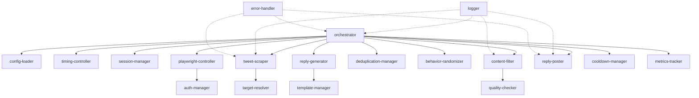

# Twitter/X Engagement Bot - Agent Registry

This directory contains all specialized Claude Code agents for the Twitter engagement automation project.

## 📁 Directory Structure

```
.claude/agents/
├── core/                   # Core orchestration
│   ├── orchestrator.md
│   └── session-manager.md
├── scraping/              # Tweet discovery
│   ├── tweet-scraper.md
│   └── target-resolver.md
├── filtering/             # Content validation
│   ├── content-filter.md
│   └── quality-checker.md
├── engagement/            # Reply generation & posting
│   ├── reply-generator.md
│   ├── reply-poster.md
│   └── template-manager.md
├── humanization/          # Anti-detection behavior
│   ├── behavior-randomizer.md
│   ├── timing-controller.md
│   └── cooldown-manager.md
├── data/                  # Data management
│   ├── deduplication-manager.md
│   └── storage-manager.md
├── monitoring/            # Observability
│   ├── logger.md
│   ├── metrics-tracker.md
│   └── error-handler.md
├── browser/               # Browser automation
│   ├── playwright-controller.md
│   └── auth-manager.md
└── config/                # Configuration
    └── config-loader.md
```

## 🎯 Agent Status

| Agent | Status | Purpose | Dependencies |
|-------|--------|---------|--------------|
| **Core** |
| orchestrator | 🟡 Planned | Main workflow coordinator | All agents |
| session-manager | 🟡 Planned | Session limits & lifecycle | config-loader, logger |
| **Scraping** |
| tweet-scraper | 🟡 Planned | Extract tweets via Playwright | playwright-controller, target-resolver |
| target-resolver | 🟡 Planned | Build Twitter URLs | None |
| **Filtering** |
| content-filter | 🟡 Planned | Apply filtering rules | config-loader, quality-checker |
| quality-checker | 🟡 Planned | Assess content quality | None |
| **Engagement** |
| reply-generator | 🟡 Planned | Generate reply text | template-manager, config-loader |
| reply-poster | 🟡 Planned | Post replies via browser | playwright-controller, error-handler |
| template-manager | 🟡 Planned | Manage reply templates | storage-manager |
| **Humanization** |
| behavior-randomizer | 🟡 Planned | Add randomness | logger |
| timing-controller | 🟡 Planned | Enforce active hours | config-loader |
| cooldown-manager | 🟡 Planned | Calculate rest periods | config-loader |
| **Data** |
| deduplication-manager | 🟡 Planned | Prevent duplicate replies | storage-manager |
| storage-manager | 🟡 Planned | File I/O operations | logger |
| **Monitoring** |
| logger | 🟡 Planned | Structured logging | storage-manager |
| metrics-tracker | 🟡 Planned | Performance metrics | storage-manager |
| error-handler | 🟡 Planned | Error recovery | logger, playwright-controller |
| **Browser** |
| playwright-controller | 🟡 Planned | Browser automation | auth-manager, error-handler |
| auth-manager | 🟡 Planned | Twitter authentication | storage-manager |
| **Config** |
| config-loader | 🟡 Planned | Load configuration | storage-manager |

**Status Legend:**
- 🟢 **Active** - Implemented and tested
- 🟡 **Planned** - Designed, ready for implementation
- 🔵 **Testing** - Implemented, under testing
- 🔴 **Deprecated** - No longer in use

## 🔄 Main Workflow



## 🚀 Quick Start

### Running a Full Session
```bash
# Call the orchestrator agent
Use orchestrator to run a complete Twitter engagement session
```

### Testing Individual Components
```bash
# Test scraping
Use tweet-scraper to scrape #BuildInPublic from last 30 minutes

# Test filtering
Use content-filter to filter these tweets with default rules

# Test reply generation
Use reply-generator to create a reply for this tweet
```

## 📋 Agent Design Principles

1. **Single Responsibility** - Each agent does ONE thing well
2. **Minimal Context** - Agents only know what they need
3. **Clear Interfaces** - Standardized inputs/outputs
4. **Composability** - Agents work together via orchestration
5. **Error Isolation** - Errors in one agent don't crash the system
6. **Testability** - Each agent can be tested independently

## 🔧 Configuration Files

Agents read from these configuration files:

```
config/
├── settings.yaml          # Main settings (filters, behavior, schedule)
├── targets.json           # Hashtags, lists, users to monitor
├── templates.json         # Reply templates
└── banned_words.txt       # Keywords to filter out
```

## 📊 Data Files

Agents write to these data files:

```
data/
├── replied_tweets.json    # Deduplication history
├── cookies.json           # Twitter session cookies
├── logs/                  # Daily log files
├── metrics/               # Session and daily metrics
└── errors/                # Error screenshots
```

## 🎭 Agent Invocation Examples

### Orchestrator (Main Entry Point)
```
Run a complete Twitter engagement session following configured schedule
```

### Tweet Scraper
```
Scrape tweets from #BuildInPublic hashtag from the last 30 minutes using Playwright
```

### Content Filter
```
Filter these 50 tweets using criteria: min 5 likes, no banned keywords, English only
```

### Reply Generator
```
Generate an authentic reply for this tweet about startup growth
```

### Reply Poster
```
Post this reply to tweet ID 1234567890 using the browser session
```

## 🔍 Debugging

### View Logs
```bash
# Today's log
cat data/logs/2025-11-07.json

# Search for errors
grep "ERROR" data/logs/*.json

# Session metrics
cat data/metrics/sessions/session-20251107-001.json
```

### Check Agent Status
All agents log their actions. Check logs for:
- `agent: "orchestrator"` - Main workflow events
- `agent: "tweet_scraper"` - Scraping activity
- `agent: "reply_poster"` - Reply posting results
- `agent: "error_handler"` - Error occurrences

## 🧪 Testing Strategy

### Unit Tests (Per Agent)
```python
# Test content filter
tweets = [mock_tweet_1, mock_tweet_2]
result = content_filter.filter_tweets(tweets)
assert len(result.eligible) == 1

# Test deduplication
assert dedup_manager.has_replied_to_tweet("123") == False
dedup_manager.record_reply("123", "user", "session-001")
assert dedup_manager.has_replied_to_tweet("123") == True
```

### Integration Tests (Multi-Agent)
```python
# Full workflow test
orchestrator.run_session(dry_run=True)
# Verify: scraping → filtering → dedup → generation (no actual posting)
```

## 🚨 Error Handling

All agents follow consistent error handling:

1. **Rate Limit / Captcha** → Abort session + 2hr cooldown
2. **Network Error** → Retry 3x with exponential backoff
3. **Element Not Found** → Screenshot + skip item
4. **Auth Lost** → Attempt reload + abort if fails
5. **Unknown Error** → Log + screenshot + continue if possible

## 📈 Performance Metrics

Key metrics tracked by agents:

- **Scraping Rate**: Tweets/minute
- **Filter Pass Rate**: % tweets passing filters
- **Deduplication Rate**: % already-replied
- **Reply Success Rate**: % successful posts
- **Session Duration**: Minutes per session
- **Error Rate**: Errors per session

## 🔐 Security & Safety

- **Rate Limiting**: Enforced by session-manager
- **Cooldowns**: Random 30-90 min between sessions
- **Active Hours**: 07:00-24:00 UK time only
- **Deduplication**: Never reply twice to same tweet/user
- **Error Screenshots**: Captured for captcha/rate limit detection

## 📝 Adding New Agents

To add a new agent:

1. Create `[category]/[agent-name].md` in `.claude/agents/`
2. Use YAML frontmatter with name, description, tags, tools, model
3. Write clear, concise system prompt (1-2 pages max)
4. Define responsibilities, methods, and interfaces
5. Update this README with agent status
6. Add to workflow diagram if needed

Example template:
```markdown
---
name: my-new-agent
description: Brief one-line description
tags: [category, feature]
tools: [read, write, bash]
model: haiku
---

You are [AgentName] - you [primary responsibility].

## Responsibilities:
- Bullet list of what this agent does

## Methods:
- method_name(inputs) → outputs

When working: [Key behavioral guidelines]
```

## 🔗 Related Documentation

- [PROJECT_OUTLINE.md](../../PROJECT_OUTLINE.md) - Full project specification
- [Anthropic Claude Code Docs](https://docs.anthropic.com/claude-code) - Agent framework
- [Playwright Docs](https://playwright.dev/python/) - Browser automation

---

**Last Updated:** 2025-11-07
**Total Agents:** 20
**Project Status:** Planning → Implementation
